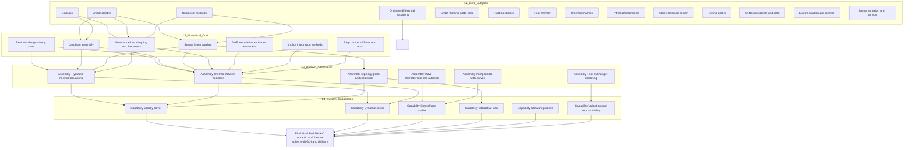

```mermaid
graph TD

%% ================= L5 Final Goal =================
G0[Final Goal Build HVAC hydraulic and thermal solver with GUI and delivery]

%% ================= L4 System Capabilities =================
subgraph L4_System_Capabilities
direction TB
C_STEADY[Capability Steady solver]
C_DYNAMIC[Capability Dynamic solver]
C_CONTROL[Capability Control loop stable]
C_GUI[Capability Interactive GUI]
C_PIPELINE[Capability Software pipeline]
C_VALID[Capability Validation and reproducibility]
end

%% L4 -> L5
C_STEADY --> G0
C_DYNAMIC --> G0
C_CONTROL --> G0
C_GUI --> G0
C_PIPELINE --> G0
C_VALID --> G0

%% ================= L3 Domain Assemblies =================
subgraph L3_Domain_Assemblies
direction TB
A_HNET[Assembly Hydraulic network equations]
A_TNET[Assembly Thermal network and coils]
A_HX[Assembly Heat exchanger modeling]
A_PUMP[Assembly Pump model with curves]
A_VALVE[Assembly Valve characteristic and authority]
A_TOPO[Assembly Topology ports and incidence]
end

%% L3 -> L4
A_HNET --> C_STEADY
A_TNET --> C_STEADY
A_TOPO --> C_STEADY
A_HNET --> C_DYNAMIC
A_TNET --> C_DYNAMIC
A_VALVE --> C_CONTROL
A_PUMP --> C_CONTROL
A_TOPO --> C_GUI
A_HX --> C_VALID

%% ================= L2 Numerical Core =================
subgraph L2_Numerical_Core
direction TB
N_SPARSE[Sparse linear algebra]
N_JAC[Jacobian assembly]
N_NEWTON[Newton method damping and line search]
N_RESID[Residual design steady state]
N_ODEINT[Implicit integration methods]
N_DAE[DAE formulation and index awareness]
N_STEP[Step control stiffness and error]
end

%% L2 -> L3
N_RESID --> A_HNET
N_JAC --> A_HNET
N_SPARSE --> A_HNET
N_RESID --> A_TNET
N_JAC --> A_TNET
N_SPARSE --> A_TNET
N_NEWTON --> A_HNET
N_NEWTON --> A_TNET
N_DAE --> A_TNET
N_ODEINT --> A_TNET
N_STEP --> A_TNET
N_SPARSE --> A_TOPO

%% ================= L1 Core Subjects =================
subgraph L1_Core_Subjects
direction TB
S_LA[Linear algebra]
S_CALC[Calculus]
S_ODE[Ordinary differential equations]
S_NUM[Numerical methods]
S_GRAPH[Graph thinking node edge]
S_FLUID[Fluid mechanics]
S_HEAT[Heat transfer]
S_THERMO[Thermodynamics]
S_PY[Python programming]
S_OOP[Object oriented design]
S_TEST[Testing and ci]
S_GUI[Qt basics signals and slots]
S_DOC[Documentation and release]
S_MEAS[Instrumentation and sensors]
end

%% L1 -> L2  (multiple prerequisites)
S_LA --> N_SPARSE
S_NUM --> N_SPARSE

S_LA --> N_JAC
S_CALC --> N_JAC

S_CALC --> N_NEWTON
S_LA --> N_NEWTON
S_NUM --> N_NEWTON

S_ODE -->_


```

